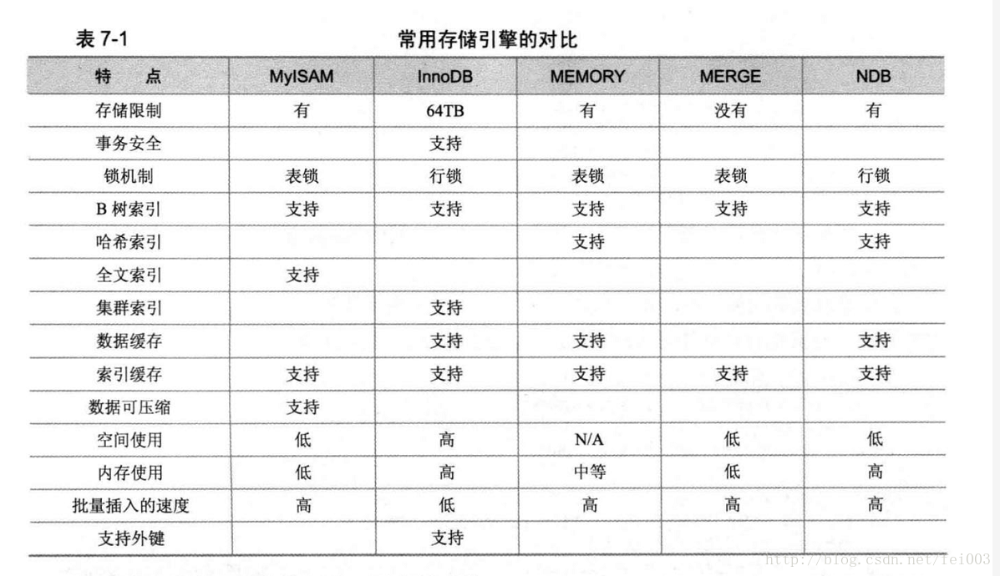
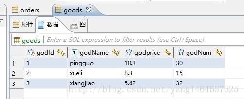
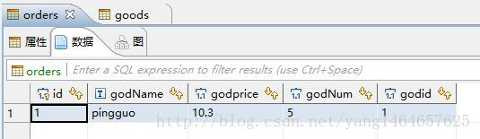

<center>Mysql作为目前主流的开源关系型数据库</center>

#### 搜索引擎：主要有 MyISAM 和 InnoDB (默认的)



InnoDB存储引擎提供了具有提交、回滚和崩溃恢复能力的事务安全。但是对比MyISAM的存储引擎，InnoDB写的处理效率差一些并且会占用更多的磁盘空间以保留数据和索引。

#### 事务四个特性：ACID

* 原子性（Atomicity）：事务包含的所有操作要么全部成功，要么全部失败回滚;成功必须要完全应用到数据库，失败则不能对数据库产生影响；

* 一致性（Consistency）：事务执行前和执行后必须处于一致性状态，

  例：用户A和用户B的前加起来一共是5000; 无论AB用户之间是如何相互转换的，事务结束后两个用户的钱加起来还是5000,这就是事务的一致性。

* 隔离性（Isolation）：可能有许多事务会同时处理相同的数据，因此每个事务都应该与其他事务隔离开来，防止数据损坏。

* 持久性（Durability）：一个事务一旦被提交了，那么对数据库中的数据的改变就是永久性的，即便在数据库系统遇到故障的情况下也不会丢失事物的操作。


#### **1.主键、外键、超键、候选键**

> **超键**：在关系中能唯一标识元组的属性集称为关系模式的超键。一个属性可以为作为一个超键，多个属性组合在一起也可以作为一个超键。超键包含候选键和主键。
>
> **候选键**：是最小超键，即没有冗余元素的超键。
>
> **主键**：数据库表中对储存数据对象予以唯一和完整标识的数据列或属性的组合。一个数据列只能有一个主键，且主键的取值不能缺失，即不能为空值（Null）。
>
> **外键**：在一个表中存在的另一个表的主键称此表的外键。

#### **2.为什么用自增列作为主键**

> 如果我们定义了主键(PRIMARY KEY)，那么InnoDB会选择主键作为聚集索引、
>
> 如果没有显式定义主键，则InnoDB会选择第一个不包含有NULL值的唯一索引作为主键索引、
>
> 如果也没有这样的唯一索引，则InnoDB会选择内置6字节长的ROWID作为隐含的聚集索引(ROWID随着行记录的写入而主键递增，这个ROWID不像ORACLE的ROWID那样可引用，是隐含的)。
>
> 数据记录本身被存于主索引（一棵B+Tree）的叶子节点上。这就要求同一个叶子节点内（大小为一个内存页或磁盘页）的各条数据记录按主键顺序存放，因此每当有一条新的记录插入时，MySQL会根据其主键将其插入适当的节点和位置，如果页面达到装载因子（InnoDB默认为15/16），则开辟一个新的页（节点）
>
> 如果表使用自增主键，那么每次插入新的记录，记录就会顺序添加到当前索引节点的后续位置，当一页写满，就会自动开辟一个新的页
>
> 如果使用非自增主键（如果身份证号或学号等），由于每次插入主键的值近似于随机，因此每次新纪录都要被插到现有索引页得中间某个位置，此时MySQL不得不为了将新记录插到合适位置而移动数据，甚至目标页面可能已经被回写到磁盘上而从缓存中清掉，此时又要从磁盘上读回来，这增加了很多开销，同时频繁的移动、分页操作造成了大量的碎片，得到了不够紧凑的索引结构，后续不得不通过OPTIMIZE TABLE来重建表并优化填充页面。

**聚集索引：** 类似字典的拼音目录。表中的数据按照聚集索引的规则来存储的。就像新华字典。整本字典是按照A-Z的顺序来排列。这也是一个表只能有一个聚集索引的原因。因为这个特点，聚集索引应该建在那些经常需要order by,group by,按范围取值的列上。因为数据本身就是按照聚集索引的顺序存储的。不应该建在需要频繁修改的列上，因为聚集索引的每次改动都以为这表中数据的物理数据的一次重新排序。就想新华字典一样。聚集索引适合建立在大数据量但是小数目不同值的列上，就像新华字典有收录了一两万的汉字，但是其拼音只有A-Z一样。但是并不是不同值越少越好。如果一个列只有极少值，如性别只有男女，在大数据量下无论是聚集索引和非聚集索引都是不适合建立的。因为其不同值辣么少。就像要查性别为男的，那么平均有一半就符合条件。就算建立索引也用处不大。值得注意的是有些数据库如sql server在你创建主键时会默认主键即为聚集索引，如果没有指定主键数据库本身也会创建一个不可见的索引，因为表本身总要有个排序规则是吧。主键作为聚集索引与大数据量但是小数目不同值适合建立聚集索引的规则是相违背的。即使这样也需要这样做的原因刚才说过，表总是需要一个排序规则的。如果你有更加合适的列适合做聚集索引是可以修改聚集索引的，但是聚集索引的修改一定一定一定要谨慎，因为聚集索引涉及要数据的物理存放数据。不合理的聚集索引会十分严重的拖累数据库的性能。注意，虽然一般主键默认就是聚集索引，但是并不代表聚集索引的值具有唯一约束，主键不等于聚集索引。这个不要弄混，刚才说过聚集索引适合大数据量但是小数目不同值的列上，聚集索引值是允许重复的，就像新华字典一样，拼音A下面会有很多字。

**非聚集索引：** 其实按照定义，除了聚集索引以外的索引都是非聚集索引，只是人们想细分一下非聚集索引，分成普通索引，唯一索引，全文索引。如果非要把非聚集索引类比成现实生活中的东西，那么非聚集索引就像新华字典的偏旁字典，他结构顺序与实际存放顺序不一定一致。  

##### 非聚集索引的二次查询问题  

非聚集索引叶节点仍然是索引节点，只是有一个指针指向对应的数据块，此如果使用非聚集索引查询，而查询列中包含了其他该索引没有覆盖的列，那么他还要进行第二次的查询，查询节点上对应的数据行的数据。

如有以下表t1：

| id   | username | score |
| ---- | -------- | ----- |
| 1    | 小明     | 90    |
| 2    | 小红     | 80    |
| 3    | 小华     | 92    |
| ..   | ..       | ..    |
| 256  | 小英     | 70    |

以及聚集索引clustered index(id), 非聚集索引index(username)。

使用以下语句进行查询，不需要进行二次查询，直接就可以从非聚集索引的节点里面就可以获取到查询列的数据。

``` mysql
select id, username from t1 where username = '小明';
select username from t1 where username = '小明';
```

但是使用以下语句进行查询，就需要二次的查询去获取原数据行的score：

```mysql
select username, score from t1 where username = '小明';
```

Mysql常见索引有：主键索引、唯一索引、普通索引、全文索引、组合索引

PRIMARY KEY（主键索引）`ALTER TABLE  table_name ADD PRIMARY KEY (column) `

UNIQUE(唯一索引)     	ALTER TABLE table_name ADD UNIQUE (column)

INDEX(普通索引)     	ALTER TABLE table_name ADD INDEX index_name (column) 

FULLTEXT(全文索引)      ALTER TABLE table_name ADD FULLTEXT (column)
组合索引   			ALTER TABLE table_name ADD INDEX index_name ( column1, column2, column3) 

Mysql各种索引区别：
普通索引：最基本的索引，没有任何限制
唯一索引：与"普通索引"类似，不同的就是：索引列的值必须唯一，但允许有空值。
主键索引：它 是一种特殊的唯一索引，不允许有空值。 
全文索引：仅可用于 MyISAM 表，针对较大的数据，生成全文索引很耗时好空间。
组合索引：为了更多的提高mysql效率可建立组合索引，遵循”最左前缀“原则。

#### **3.触发器的作用？**

一类特殊的数据库程序，可以监视某种数据的操作(insert/update/delete),并触发相关的操作(insert/update/delete)，保护数据的完整性。

例如：当一个用户完整信息保存在A/B/C三张表中，传统方法维护用户信息需要将对应的信息使用条SQL语句，依次插入，但是使用触发器的方式的话，我们可以只用插入A表中一条数据，就会自动触发数据插入B/C表的操作，这样就可以通过一个表的操作，同步其他操作，实现自动化维护数据的目的。

触发器是一种特殊的存储过程，主要是通过事件来触发而被执行的。它可以强化约束，来维护数据的完整性和一致性，可以跟踪数据库内的操作从而不允许未经许可的更新和变化。可以联级运算。如，某表上的触发器上包含对另一个表的数据操作，而该操作又会导致该表触发器被触发。

*触发器语法格式:*

creat trigger 触发器名称
after/before(触发器工作的时机)
update/delete/insert(触发器监听事件)
on 表名(触发器监听的目标表)
for each row(行级监视，mysql固定写法，oracle不同)
begin
  sql语句集........（触发器执行动作，分号结尾）
end;

**tips：**一般情况下，mysql默认是以 ; 作为结束执行语句，与触发器中需要的分行起冲突为解决此问题可用DELIMITER，如：DELIMITER $，可以将结束符号变成\$当触发器创建完成后，可以用DELIMITER ; 来将结束符号变成;

删除触发器：drop trigger if exist 触发器名称
查询数据库触发器：show triggers;

**行变量**：当目标表发生改变时候，变化的行可用行变量表示

> new:代表目标表目标行发生改变之后的行
> old:代表目标表目标行发生改变之前的行

**触发器案例：商品表/订单表(商品数量控制)**

<div align="center">
    
</div>

<div align="center">
    
</div>

##### 触发器监听： insert

```mysql
delimiter $ -- 定界符设置为 $
create trigger tr1
after insert on orders
for each row
begin 
update goods set godnum = godnum - new.godnum where godid=new.godid;
end
$
delimiter ; -- 定界符设置回 ;
```

分析：orders表添加新的记录之后，goods表对应的商品数量同步减少对应的商品订单出数量

##### 触发器监听 ：delete

``` mysql
delimiter $
create trigger tr2
after delete on orders
for each row
begin
update goods set godnum=godnum+old.godnum where godid=old.godid;
end
$
delimiter ;
```

分析：客户删除订单，恢复商品表对应商品的数量

##### 触发器监听：update

``` mysql
delimiter $
create trigger tr2
after update on orders
for each row
begin
update goods set godnum=godnum+(old.godnum-new.godnum)
where godid=old.godid;
end
$
delimiter ;
```

分析：客户修改订单，商品表对应商品数量同步更新

##### 触发器声明变量用法：

``` mysql
delimiter $
create trigger tr4
before insert on orders
for each row
begin
    declare godSum int default 0;  -- 定义触发器变量
    select godNum  into godSum from goods where godid = new.godid; -- 变量赋值
    if godSum< new.godNum  then -- 触发器控制逻辑
    update goods set godNum = new.godNum where godid = new.godid;
    end if;
end$
delimiter ;
```

分析：当客户新建订单超过商品表的商品数量则修改商品表，保商品表商品库存量非负 *只是一个例子，实际感觉不应该这么做*

#### **4.什么是存储过程？用什么来调用？**

> 存储过程是一个预编译的SQL语句，优点是允许模块化的设计，就是说只需创建一次，以后在该程序中就可以调用多次。如果某次操作需要执行多次SQL，使用存储过程比单纯SQL语句执行要快。
>
> **调用：**
>
> 1）可以用一个命令对象来调用存储过程。
>
> 2）可以供外部程序调用，比如：java程序。

#### **5.存储过程的优缺点？**

> **优点：**
>
> 1）存储过程是预编译过的，执行效率高。
>
> 2）存储过程的代码直接存放于数据库中，通过存储过程名直接调用，减少网络通讯。
>
> 3）安全性高，执行存储过程需要有一定权限的用户。
>
> 4）存储过程可以重复使用，可减少数据库开发人员的工作量。
>
> **缺点：**移植性差


重命名表名：   							ALTER TABLE tt RENAME tt1;

添加一个列： 								ALTER TABLE tt ADD c1 varchar(100);

删除一个列：								ALTER TABLE tt DROP COLUMN c1 varchar(100);

修改一个列的数据类型：					ALTER TABLE tt MODIFY c1 varchar(100);

重命名一个列：							ALTER TABLE tt CHANGE COLUMN cc cc1 varchar(100);

向表中插入数据：							INSERT INTO tt VALUES(1, 'dfs',33,'df');

​										INSERT INTO tt(id, name) VALUES(1, 'dfs');

删除表									DELETE * FROM tt;

​										DELETE FROM tt WHERE id=3;

更新记录									UPDATE tt SET c1='df' WHERE id=3;

返回结果去重：							SELECT DISTINCT c1 FROM tt;

排序：									SELECT * FROM tt ORDER BY c1;

​										SELECT * FROM tt ORDER BY c1 DESC;

创建新用户：								CREATE USER zjp IDENTIFIED BY 'zhuang88';

删除用户：								DROP USER zjp;

重命名用户：								RENAME USER zjp TO cy;

修改用户密码：							SET PASSWORD=PASSWORD('zhuang88');

​										SET PASSWORD FOR zjp=PASSWORD('zhuang88');

授予用户权限：							GRANT

撤销权限：								REVOKE

